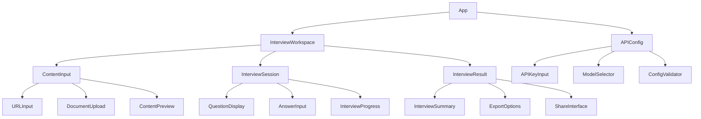
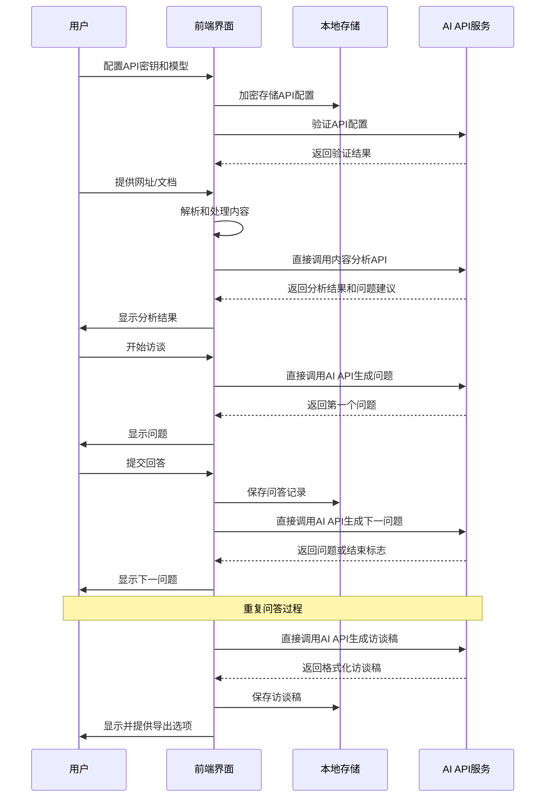
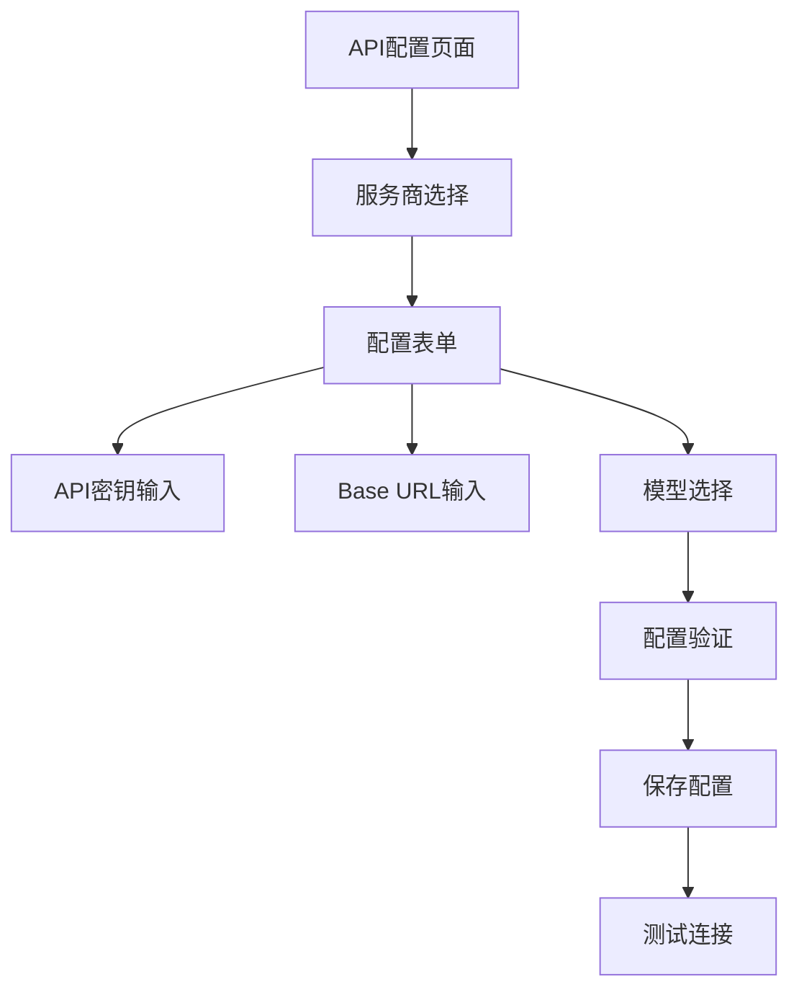
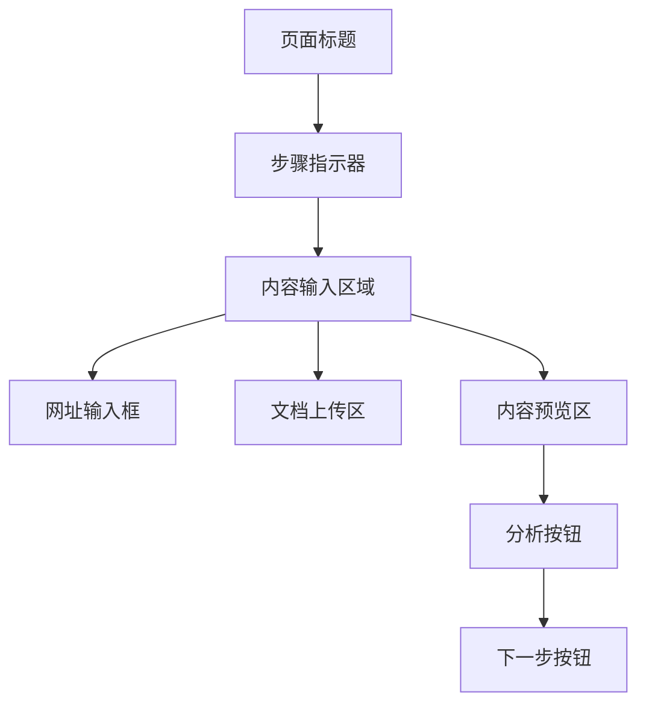
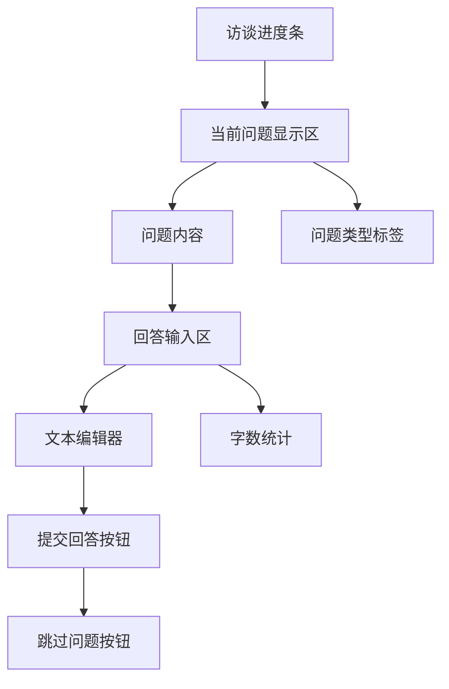

# AI访谈工具设计文档

## 1. 概述

AI访谈工具是一个基于React的前端应用，旨在帮助独立创作者通过AI自动化访谈流程。工具通过分析用户提供的网址和文档内容，生成有深度的访谈问题，并记录创作者的回答，最终生成完整的访谈稿。

### 核心功能
- 内容分析：解析用户提供的网址、文档作为上下文
- 智能提问：基于上下文生成有深度的访谈问题  
- 互动访谈：创作者实时回答AI生成的问题
- 访谈稿生成：自动整理问答内容，生成结构化访谈稿

### 目标用户
- 独立创作者（博主、作家、艺术家等）
- 内容创作团队
- 媒体从业者

## 2. 技术栈与依赖

### 前端技术栈
- **框架**: React 18.2.0 + Vite 4.4.5
- **UI组件**: Mantine 6.0.20
- **样式**: Tailwind CSS 3.3.3
- **状态管理**: Zustand 4.4.1
- **路由**: React Router DOM 6.15.0
- **数据获取**: SWR 2.2.2
- **样式预处理**: Sass 1.66.1

### 新增依赖需求
```json
{
  "dependencies": {
    "axios": "^1.5.0",
    "react-markdown": "^8.0.7",
    "react-syntax-highlighter": "^15.5.0",
    "date-fns": "^2.30.0",
    "uuid": "^9.0.0",
    "crypto-js": "^4.1.1"
  }
}
```

## 3. 组件架构

### 3.1 组件层次结构



### 3.2 核心组件定义

#### APIConfig (API配置组件)
```jsx
// 主要职责：管理AI API配置信息
const APIConfig = ({ onConfigComplete }) => {
  const [apiKey, setApiKey] = useState('');
  const [baseUrl, setBaseUrl] = useState('');
  const [model, setModel] = useState('gpt-3.5-turbo');
  const [isValidating, setIsValidating] = useState(false);
  
  // 验证API配置有效性
  const validateConfig = async () => {
    // 测试API连接
  };
  
  // 保存配置到本地存储（加密）
  const saveConfig = () => {
    // 加密存储敏感信息
  };
}
```

#### InterviewWorkspace (主工作区)
```jsx
// 主要职责：管理整个访谈流程状态
const InterviewWorkspace = () => {
  const [currentStep, setCurrentStep] = useState('api-config');
  const [interviewData, setInterviewData] = useState(null);
  const [apiConfig, setApiConfig] = useState(null);
  
  // 检查API配置状态
  useEffect(() => {
    const config = APIConfigManager.loadConfig();
    if (config && config.isValid) {
      setApiConfig(config);
      setCurrentStep('content-input');
    }
  }, []);
}
```

#### ContentInput (内容输入组件)
```jsx
// 主要职责：收集和预处理访谈上下文
const ContentInput = ({ onContentReady }) => {
  const [urls, setUrls] = useState([]);
  const [documents, setDocuments] = useState([]);
  const [analysisResult, setAnalysisResult] = useState(null);
  // 处理内容分析和验证
}
```

#### InterviewSession (访谈会话组件)
```jsx
// 主要职责：管理问答交互流程
const InterviewSession = ({ context, onComplete }) => {
  const [questions, setQuestions] = useState([]);
  const [currentQuestionIndex, setCurrentQuestionIndex] = useState(0);
  const [answers, setAnswers] = useState({});
  // 处理AI提问和用户回答
}
```

## 4. 状态管理

### 4.1 全局状态结构 (Zustand)

```javascript
const useInterviewStore = create((set, get) => ({
  // API配置状态
  apiState: {
    apiKey: null,
    baseUrl: null,
    model: 'gpt-3.5-turbo',
    isConfigured: false,
    isValidating: false,
    lastValidated: null,
  },
  
  // 访谈流程状态
  interviewState: {
    currentStep: 'api-config', // api-config | content-input | analyzing | interviewing | completed
    sessionId: null,
    createdAt: null,
  },
  
  // 内容分析状态
  contentState: {
    sources: [], // 网址和文档列表
    analysisResult: null, // AI分析结果
    isAnalyzing: false,
  },
  
  // 访谈会话状态
  sessionState: {
    questions: [], // AI生成的问题列表
    answers: {}, // 用户回答记录
    currentQuestionIndex: 0,
    isGeneratingQuestion: false,
  },
  
  // 访谈结果状态
  resultState: {
    interviewScript: null, // 最终访谈稿
    exportFormat: 'markdown', // markdown | pdf | docx
    isGenerating: false,
  },
  
  // Actions
  updateApiState: (updates) => set((state) => ({
    apiState: { ...state.apiState, ...updates }
  })),
  
  validateApiConfig: async (config) => {
    set((state) => ({ apiState: { ...state.apiState, isValidating: true } }));
    try {
      const isValid = await APIConfigManager.validateConfig(config);
      set((state) => ({
        apiState: {
          ...state.apiState,
          isValidating: false,
          isConfigured: isValid,
          lastValidated: new Date().toISOString()
        }
      }));
      return isValid;
    } catch (error) {
      set((state) => ({ apiState: { ...state.apiState, isValidating: false } }));
      throw error;
    }
  },
  
  updateInterviewState: (updates) => set((state) => ({
    interviewState: { ...state.interviewState, ...updates }
  })),
  
  updateContentState: (updates) => set((state) => ({
    contentState: { ...state.contentState, ...updates }
  })),
  
  updateSessionState: (updates) => set((state) => ({
    sessionState: { ...state.sessionState, ...updates }
  })),
  
  updateResultState: (updates) => set((state) => ({
    resultState: { ...state.resultState, ...updates }
  })),
}));
```

## 5. 数据流架构

### 5.1 主要数据流



## 6. API配置与集成层

### 6.1 API配置管理

```javascript
// lib/apiConfig.js
import CryptoJS from 'crypto-js';

const ENCRYPTION_KEY = 'ai-interview-tool-secret-key';
const CONFIG_STORAGE_KEY = 'ai_interview_api_config';

export class APIConfigManager {
  // 保存API配置（加密存储）
  static saveConfig(config) {
    const encryptedConfig = {
      apiKey: CryptoJS.AES.encrypt(config.apiKey, ENCRYPTION_KEY).toString(),
      baseUrl: config.baseUrl,
      model: config.model,
      createdAt: new Date().toISOString(),
      isValid: false
    };
    
    localStorage.setItem(CONFIG_STORAGE_KEY, JSON.stringify(encryptedConfig));
    return encryptedConfig;
  }
  
  // 加载API配置（解密）
  static loadConfig() {
    const stored = localStorage.getItem(CONFIG_STORAGE_KEY);
    if (!stored) return null;
    
    try {
      const config = JSON.parse(stored);
      const decryptedApiKey = CryptoJS.AES.decrypt(config.apiKey, ENCRYPTION_KEY).toString(CryptoJS.enc.Utf8);
      
      return {
        ...config,
        apiKey: decryptedApiKey
      };
    } catch (error) {
      console.error('Failed to load API config:', error);
      return null;
    }
  }
  
  // 验证API配置
  static async validateConfig(config) {
    try {
      const testResponse = await AIAPIClient.testConnection(config);
      
      if (testResponse.success) {
        // 更新配置为已验证
        const storedConfig = this.loadConfig();
        if (storedConfig) {
          storedConfig.isValid = true;
          storedConfig.lastValidated = new Date().toISOString();
          localStorage.setItem(CONFIG_STORAGE_KEY, JSON.stringify({
            ...storedConfig,
            apiKey: CryptoJS.AES.encrypt(config.apiKey, ENCRYPTION_KEY).toString()
          }));
        }
        return true;
      }
      return false;
    } catch (error) {
      console.error('API validation failed:', error);
      return false;
    }
  }
  
  // 清除配置
  static clearConfig() {
    localStorage.removeItem(CONFIG_STORAGE_KEY);
  }
}
```

### 6.2 AI API客户端

```javascript
// lib/aiClient.js
import axios from 'axios';

export class AIAPIClient {
  constructor(config) {
    this.config = config;
    this.client = axios.create({
      baseURL: config.baseUrl,
      headers: {
        'Authorization': `Bearer ${config.apiKey}`,
        'Content-Type': 'application/json'
      },
      timeout: 30000
    });
  }
  
  // 测试API连接
  static async testConnection(config) {
    const client = new AIAPIClient(config);
    try {
      const response = await client.client.post('/chat/completions', {
        model: config.model,
        messages: [{ role: 'user', content: 'Hello' }],
        max_tokens: 5
      });
      
      return { success: true, data: response.data };
    } catch (error) {
      return { 
        success: false, 
        error: error.response?.data?.error?.message || error.message 
      };
    }
  }
  
  // 内容分析
  async analyzeContent(sources) {
    const prompt = this.buildContentAnalysisPrompt(sources);
    
    const response = await this.client.post('/chat/completions', {
      model: this.config.model,
      messages: [
        {
          role: 'system',
          content: '你是一个专业的访谈助手，擅长分析内容并生成有深度的访谈问题。'
        },
        {
          role: 'user',
          content: prompt
        }
      ],
      max_tokens: 2000,
      temperature: 0.7
    });
    
    return this.parseAnalysisResponse(response.data);
  }
  
  // 生成访谈问题
  async generateQuestion(context, history) {
    const prompt = this.buildQuestionPrompt(context, history);
    
    const response = await this.client.post('/chat/completions', {
      model: this.config.model,
      messages: [
        {
          role: 'system',
          content: '你是一个经验丰富的访谈主持人，能够根据上下文和对话历史生成有深度、有启发性的访谈问题。'
        },
        {
          role: 'user',
          content: prompt
        }
      ],
      max_tokens: 500,
      temperature: 0.8
    });
    
    return this.parseQuestionResponse(response.data);
  }
  
  // 生成访谈稿
  async generateScript(sessionData) {
    const prompt = this.buildScriptPrompt(sessionData);
    
    const response = await this.client.post('/chat/completions', {
      model: this.config.model,
      messages: [
        {
          role: 'system',
          content: '你是一个专业的文字编辑，擅长将问答内容整理成结构清晰、阅读流畅的访谈稿。'
        },
        {
          role: 'user',
          content: prompt
        }
      ],
      max_tokens: 4000,
      temperature: 0.5
    });
    
    return this.parseScriptResponse(response.data);
  }
  
  // 构建内容分析提示词
  buildContentAnalysisPrompt(sources) {
    const sourceTexts = sources.map((source, index) => 
      `## 内容${index + 1}（${source.type}）\n${source.content}`
    ).join('\n\n');
    
    return `请分析以下内容，并为即将进行的访谈做准备：

${sourceTexts}

请提供：
1. 内容摘要（200字以内）
2. 关键主题和亮点（3-5个）
3. 建议的访谈问题方向（5-8个）
4. 访谈难度评估（初级/中级/高级）

请以JSON格式返回结果。`;
  }
  
  // 构建问题生成提示词
  buildQuestionPrompt(context, history) {
    const contextSummary = context.analysisResult?.summary || '无特定上下文';
    const previousQA = history.questions.map((q, i) => 
      `Q${i + 1}: ${q.content}\nA${i + 1}: ${history.answers[q.id]?.content || '未回答'}`
    ).join('\n\n');
    
    return `基于以下上下文和对话历史，生成下一个有深度的访谈问题：

## 访谈上下文
${contextSummary}

## 已完成的问答
${previousQA || '暂无历史对话'}

请生成一个：
1. 有深度和启发性的问题
2. 与上下文相关但不重复之前的问题
3. 能够引出创作者独特见解的问题

请以JSON格式返回：{"question": "问题内容", "category": "问题分类", "isFollowUp": false}`;
  }
  
  // 构建访谈稿生成提示词
  buildScriptPrompt(sessionData) {
    const qaContent = sessionData.questions.map((q, i) => 
      `**${i + 1}. ${q.content}**\n\n${sessionData.answers[q.id]?.content || '（未回答）'}\n`
    ).join('\n');
    
    return `请将以下问答内容整理成一份专业的访谈稿：

## 访谈背景
${sessionData.context?.analysisResult?.summary || '无特定背景'}

## 问答内容
${qaContent}

请按以下要求整理：
1. 添加适当的标题和副标题
2. 保持问答的完整性和逻辑性
3. 适当润色语言，提高可读性
4. 保持访谈者的原意不变
5. 使用Markdown格式

请直接返回整理好的访谈稿内容。`;
  }
  
  // 解析分析响应
  parseAnalysisResponse(response) {
    try {
      const content = response.choices[0].message.content;
      return JSON.parse(content);
    } catch (error) {
      // 如果JSON解析失败，返回基础结构
      return {
        summary: response.choices[0].message.content.substring(0, 200),
        keyTopics: [],
        suggestedQuestions: [],
        difficulty: 'intermediate'
      };
    }
  }
  
  // 解析问题响应
  parseQuestionResponse(response) {
    try {
      const content = response.choices[0].message.content;
      const parsed = JSON.parse(content);
      return {
        id: `q_${Date.now()}`,
        content: parsed.question,
        category: parsed.category || 'general',
        isFollowUp: parsed.isFollowUp || false,
        timestamp: new Date().toISOString()
      };
    } catch (error) {
      // JSON解析失败时的fallback
      return {
        id: `q_${Date.now()}`,
        content: response.choices[0].message.content,
        category: 'general',
        isFollowUp: false,
        timestamp: new Date().toISOString()
      };
    }
  }
  
  // 解析访谈稿响应
  parseScriptResponse(response) {
    const content = response.choices[0].message.content;
    return {
      content,
      format: 'markdown',
      wordCount: content.split(/\s+/).length,
      estimatedReadTime: Math.ceil(content.split(/\s+/).length / 200),
      generatedAt: new Date().toISOString()
    };
  }
}
```

### 6.2 数据模型

```javascript
// 访谈会话数据结构
const InterviewSession = {
  id: 'uuid',
  createdAt: 'timestamp',
  updatedAt: 'timestamp',
  status: 'active' | 'completed' | 'draft',
  
  // 上下文信息
  context: {
    sources: [
      {
        id: 'uuid',
        type: 'url' | 'document',
        title: 'string',
        content: 'string',
        metadata: {
          url: 'string',
          filename: 'string',
          size: 'number',
          uploadedAt: 'timestamp'
        }
      }
    ],
    analysisResult: {
      summary: 'string',
      keyTopics: ['string'],
      suggestedQuestions: ['string'],
      difficulty: 'beginner' | 'intermediate' | 'advanced'
    }
  },
  
  // 问答记录
  conversation: [
    {
      id: 'uuid',
      type: 'question' | 'answer',
      content: 'string',
      timestamp: 'timestamp',
      metadata: {
        questionIndex: 'number',
        isFollowUp: 'boolean',
        category: 'string'
      }
    }
  ],
  
  // 访谈结果
  result: {
    script: 'string',
    format: 'markdown' | 'html',
    wordCount: 'number',
    estimatedReadTime: 'number',
    exportUrls: {
      markdown: 'url',
      pdf: 'url',
      docx: 'url'
    }
  }
};
```

## 7. 页面路由结构

### 7.1 路由配置

```javascript
// src/routes/index.jsx
const routes = [
  {
    path: '/',
    element: <HomePage />,
  },
  {
    path: '/api-config',
    element: <APIConfigPage />,
  },
  {
    path: '/interview',
    element: <InterviewWorkspace />,
    children: [
      {
        path: 'new',
        element: <NewInterviewWizard />
      },
      {
        path: ':sessionId',
        element: <InterviewSession />
      },
      {
        path: ':sessionId/result',
        element: <InterviewResult />
      }
    ]
  },
  {
    path: '/history',
    element: <InterviewHistory />
  },
  {
    path: '/settings',
    element: <Settings />
  }
];
```

### 7.2 页面组件结构

```javascript
// 主页面组件
const HomePage = () => {
  // 展示功能介绍和快速开始按钮
  // 检查API配置状态，未配置时引导用户配置
}

const APIConfigPage = () => {
  // API配置页面：API密钥、BaseURL、模型选择、配置验证
  const [config, setConfig] = useState({
    apiKey: '',
    baseUrl: 'https://api.openai.com/v1',
    model: 'gpt-3.5-turbo'
  });
  
  // 支持多种AI服务商配置（OpenAI、Claude、本地模型等）
}

const InterviewWorkspace = () => {
  // 访谈工作区，包含步骤导航和当前步骤内容
  // 在开始前检查API配置状态
}

const InterviewHistory = () => {
  // 历史访谈记录管理
}

const Settings = () => {
  // 通用设置：导出格式、界面主题等
  // API配置移至独立页面
}
```

## 8. 业务逻辑层

### 8.1 核心业务流程

#### 内容分析流程
```javascript
// lib/interviewEngine.js
import { AIAPIClient } from './aiClient.js';
import { APIConfigManager } from './apiConfig.js';

export class InterviewEngine {
  static async processContent(sources) {
    const processedSources = [];
    
    for (const source of sources) {
      if (source.type === 'url') {
        const content = await this.fetchWebContent(source.url);
        processedSources.push({
          ...source,
          content: this.extractMainContent(content),
          metadata: this.analyzeContentMetadata(content)
        });
      } else if (source.type === 'document') {
        const content = await this.parseDocument(source.file);
        processedSources.push({
          ...source,
          content,
          metadata: this.analyzeDocumentMetadata(source.file)
        });
      }
    }
    
    // 使用AI分析内容
    const apiConfig = APIConfigManager.loadConfig();
    if (!apiConfig || !apiConfig.isValid) {
      throw new Error('API configuration is not valid');
    }
    
    const aiClient = new AIAPIClient(apiConfig);
    const analysisResult = await aiClient.analyzeContent(processedSources);
    
    return {
      sources: processedSources,
      analysisResult
    };
  }
  
  static async fetchWebContent(url) {
    // 使用代理服务或CORS代理获取网页内容
    try {
      const proxyUrl = `https://api.allorigins.win/raw?url=${encodeURIComponent(url)}`;
      const response = await fetch(proxyUrl);
      const html = await response.text();
      return html;
    } catch (error) {
      console.error('Failed to fetch web content:', error);
      throw new Error(`无法获取网页内容: ${error.message}`);
    }
  }
  
  static extractMainContent(html) {
    // 简单的内容提取逻辑
    const parser = new DOMParser();
    const doc = parser.parseFromString(html, 'text/html');
    
    // 移除脚本和样式
    const scripts = doc.querySelectorAll('script, style');
    scripts.forEach(el => el.remove());
    
    // 尝试找到主要内容区域
    const contentSelectors = ['main', 'article', '.content', '#content', '.post', '.entry'];
    for (const selector of contentSelectors) {
      const element = doc.querySelector(selector);
      if (element) {
        return element.textContent.trim();
      }
    }
    
    // 如果没找到，返回body内容
    return doc.body?.textContent?.trim() || '';
  }
  
  static async parseDocument(file) {
    return new Promise((resolve, reject) => {
      const reader = new FileReader();
      reader.onload = (e) => {
        const content = e.target.result;
        // 根据文件类型解析内容
        if (file.type === 'text/plain' || file.name.endsWith('.txt')) {
          resolve(content);
        } else if (file.type === 'application/json') {
          try {
            const json = JSON.parse(content);
            resolve(JSON.stringify(json, null, 2));
          } catch (error) {
            resolve(content);
          }
        } else {
          resolve(content);
        }
      };
      reader.onerror = reject;
      reader.readAsText(file);
    });
  }
  
  static analyzeContentMetadata(content) {
    return {
      wordCount: content.split(/\s+/).length,
      charCount: content.length,
      estimatedReadTime: Math.ceil(content.split(/\s+/).length / 200)
    };
  }
  
  static analyzeDocumentMetadata(file) {
    return {
      fileName: file.name,
      fileSize: file.size,
      fileType: file.type,
      lastModified: new Date(file.lastModified).toISOString()
    };
  }
}
```

#### 访谈会话管理
```javascript
import { AIAPIClient } from './aiClient.js';
import { APIConfigManager } from './apiConfig.js';

export class InterviewSession {
  constructor(sessionId, context) {
    this.sessionId = sessionId;
    this.context = context;
    this.questions = [];
    this.answers = {};
    this.currentIndex = 0;
    this.aiClient = null;
    
    // 初始化AI客户端
    this.initializeAIClient();
  }
  
  initializeAIClient() {
    const apiConfig = APIConfigManager.loadConfig();
    if (!apiConfig || !apiConfig.isValid) {
      throw new Error('API configuration is not valid');
    }
    this.aiClient = new AIAPIClient(apiConfig);
  }
  
  async startInterview() {
    const firstQuestion = await this.aiClient.generateQuestion(
      this.context, 
      { currentIndex: 0, questions: [], answers: {} }
    );
    
    this.questions.push(firstQuestion);
    return firstQuestion;
  }
  
  async submitAnswer(questionId, answer) {
    this.answers[questionId] = {
      content: answer,
      timestamp: new Date().toISOString(),
      wordCount: answer.split(/\s+/).length,
      charCount: answer.length
    };
    
    // 自动保存会话状态
    this.saveSession();
    
    // 生成下一个问题
    const nextQuestion = await this.generateNextQuestion();
    if (nextQuestion) {
      this.questions.push(nextQuestion);
      this.currentIndex++;
      this.saveSession();
    }
    
    return nextQuestion;
  }
  
  async generateNextQuestion() {
    // 检查是否应该结束访谈
    if (this.shouldEndInterview()) {
      return null;
    }
    
    return this.aiClient.generateQuestion(this.context, {
      questions: this.questions,
      answers: this.answers,
      currentIndex: this.currentIndex + 1
    });
  }
  
  shouldEndInterview() {
    // 访谈结束条件
    const maxQuestions = 15;
    const minQuestions = 5;
    const totalWordCount = Object.values(this.answers)
      .reduce((sum, answer) => sum + (answer.wordCount || 0), 0);
    
    return this.questions.length >= maxQuestions || 
           (this.questions.length >= minQuestions && totalWordCount >= 1000);
  }
  
  async generateScript(format = 'markdown') {
    return this.aiClient.generateScript({
      sessionId: this.sessionId,
      questions: this.questions,
      answers: this.answers,
      context: this.context,
      format
    });
  }
  
  saveSession() {
    const sessionData = {
      sessionId: this.sessionId,
      context: this.context,
      questions: this.questions,
      answers: this.answers,
      currentIndex: this.currentIndex,
      status: this.shouldEndInterview() ? 'completed' : 'active',
      updatedAt: new Date().toISOString()
    };
    
    localStorage.setItem(`interview_session_${this.sessionId}`, JSON.stringify(sessionData));
  }
  
  static loadSession(sessionId) {
    const data = localStorage.getItem(`interview_session_${sessionId}`);
    if (!data) return null;
    
    try {
      const sessionData = JSON.parse(data);
      const session = new InterviewSession(sessionId, sessionData.context);
      session.questions = sessionData.questions || [];
      session.answers = sessionData.answers || {};
      session.currentIndex = sessionData.currentIndex || 0;
      return session;
    } catch (error) {
      console.error('Failed to load session:', error);
      return null;
    }
  }
  
  getProgress() {
    const totalAnswered = Object.keys(this.answers).length;
    const totalQuestions = this.questions.length;
    const completionPercentage = totalQuestions > 0 ? (totalAnswered / totalQuestions) * 100 : 0;
    
    return {
      totalQuestions,
      totalAnswered,
      completionPercentage: Math.round(completionPercentage),
      estimatedTimeRemaining: this.estimateRemainingTime()
    };
  }
  
  estimateRemainingTime() {
    const avgTimePerQuestion = 3; // 假设每个问题平均3分钟
    const remainingQuestions = Math.max(0, this.questions.length - Object.keys(this.answers).length);
    return remainingQuestions * avgTimePerQuestion;
  }
}
```

## 9. 用户界面设计

### 9.1 主要界面布局

#### API配置界面


#### 内容输入界面


#### 访谈进行界面


### 9.2 交互设计要点

- **渐进式信息披露**: 将复杂流程分解为简单步骤
- **实时反馈**: 显示处理进度、字数统计、预计时间
- **智能提示**: 根据输入内容提供相关建议
- **快捷操作**: 支持键盘快捷键、自动保存
- **响应式设计**: 适配桌面和平板设备

## 10. 数据存储策略

### 10.1 API配置安全存储

```javascript
// lib/secureStorage.js
import CryptoJS from 'crypto-js';

export class SecureStorage {
  static encryptData(data, key) {
    return CryptoJS.AES.encrypt(JSON.stringify(data), key).toString();
  }
  
  static decryptData(encryptedData, key) {
    try {
      const bytes = CryptoJS.AES.decrypt(encryptedData, key);
      return JSON.parse(bytes.toString(CryptoJS.enc.Utf8));
    } catch (error) {
      console.error('Decryption failed:', error);
      return null;
    }
  }
  
  // 生成基于设备的加密密钥
  static generateDeviceKey() {
    const userAgent = navigator.userAgent;
    const language = navigator.language;
    const platform = navigator.platform;
    const deviceInfo = `${userAgent}-${language}-${platform}`;
    return CryptoJS.SHA256(deviceInfo).toString();
  }
}
```

### 10.2 本地存储 (LocalStorage)

```javascript
// lib/storage.js
export class InterviewStorage {
  static saveSession(sessionId, data) {
    localStorage.setItem(`interview_session_${sessionId}`, JSON.stringify({
      ...data,
      lastSaved: new Date().toISOString()
    }));
  }
  
  static loadSession(sessionId) {
    const data = localStorage.getItem(`interview_session_${sessionId}`);
    return data ? JSON.parse(data) : null;
  }
  
  static listSessions() {
    const sessions = [];
    for (let i = 0; i < localStorage.length; i++) {
      const key = localStorage.key(i);
      if (key.startsWith('interview_session_')) {
        const sessionId = key.replace('interview_session_', '');
        const data = JSON.parse(localStorage.getItem(key));
        sessions.push({ sessionId, ...data });
      }
    }
    return sessions.sort((a, b) => new Date(b.lastSaved) - new Date(a.lastSaved));
  }
}
```

### 10.2 会话恢复机制

```javascript
// hooks/useSessionRecovery.js
export const useSessionRecovery = () => {
  const [recoverableSessions, setRecoverableSessions] = useState([]);
  
  useEffect(() => {
    const sessions = InterviewStorage.listSessions();
    const incomplete = sessions.filter(s => s.status !== 'completed');
    setRecoverableSessions(incomplete);
  }, []);
  
  const recoverSession = useCallback((sessionId) => {
    const sessionData = InterviewStorage.loadSession(sessionId);
    if (sessionData) {
      // 恢复访谈状态
      return new InterviewSession(sessionId, sessionData.context);
    }
  }, []);
  
  return { recoverableSessions, recoverSession };
};
```

## 11. 测试策略

### 11.1 单元测试

```javascript
// __tests__/APIConfigManager.test.js
describe('APIConfigManager', () => {
  beforeEach(() => {
    localStorage.clear();
  });
  
  test('should save and load encrypted config', () => {
    const config = {
      apiKey: 'test-api-key',
      baseUrl: 'https://api.openai.com/v1',
      model: 'gpt-3.5-turbo'
    };
    
    APIConfigManager.saveConfig(config);
    const loaded = APIConfigManager.loadConfig();
    
    expect(loaded.apiKey).toBe(config.apiKey);
    expect(loaded.baseUrl).toBe(config.baseUrl);
    expect(loaded.model).toBe(config.model);
  });
  
  test('should validate API configuration', async () => {
    const validConfig = {
      apiKey: 'valid-key',
      baseUrl: 'https://api.openai.com/v1',
      model: 'gpt-3.5-turbo'
    };
    
    // Mock successful API response
    global.fetch = jest.fn().mockResolvedValue({
      ok: true,
      json: () => Promise.resolve({ choices: [{ message: { content: 'Hello' } }] })
    });
    
    const isValid = await APIConfigManager.validateConfig(validConfig);
    expect(isValid).toBe(true);
  });
});

// __tests__/InterviewEngine.test.js
describe('InterviewEngine', () => {
  beforeEach(() => {
    // Mock API configuration
    jest.spyOn(APIConfigManager, 'loadConfig').mockReturnValue({
      apiKey: 'test-key',
      baseUrl: 'https://api.openai.com/v1',
      model: 'gpt-3.5-turbo',
      isValid: true
    });
  });
  
  test('should process URL content correctly', async () => {
    const mockUrl = 'https://example.com/article';
    
    // Mock fetch response
    global.fetch = jest.fn().mockResolvedValue({
      text: () => Promise.resolve('<html><body><p>Test content</p></body></html>')
    });
    
    const result = await InterviewEngine.processContent([
      { type: 'url', url: mockUrl }
    ]);
    
    expect(result).toHaveProperty('sources');
    expect(result).toHaveProperty('analysisResult');
    expect(result.sources[0]).toHaveProperty('content');
  });
  
  test('should throw error when API not configured', async () => {
    jest.spyOn(APIConfigManager, 'loadConfig').mockReturnValue(null);
    
    await expect(InterviewEngine.processContent([
      { type: 'url', url: 'https://example.com' }
    ])).rejects.toThrow('API configuration is not valid');
  });
});
```

### 11.2 集成测试

```javascript
// __tests__/InterviewFlow.test.js
describe('Interview Flow Integration', () => {
  test('complete interview workflow', async () => {
    // 1. 内容分析
    const sources = [{ type: 'url', url: 'https://test.com' }];
    const context = await InterviewEngine.processContent(sources);
    
    // 2. 开始访谈
    const session = new InterviewSession('test-session', context);
    const firstQuestion = await session.startInterview();
    
    // 3. 提交回答
    const answer = 'This is a test answer';
    const nextQuestion = await session.submitAnswer(firstQuestion.id, answer);
    
    // 4. 生成访谈稿
    const script = await session.generateScript();
    
    expect(script).toHaveProperty('content');
    expect(script.content).toContain(answer);
  });
});
```

### 11.3 用户体验测试

- **可用性测试**: 验证用户能够顺利完成完整访谈流程
- **性能测试**: 确保内容分析和问题生成在合理时间内完成
- **兼容性测试**: 验证在不同浏览器和设备上的表现
- **错误处理测试**: 验证网络异常、API失败等场景的处理


